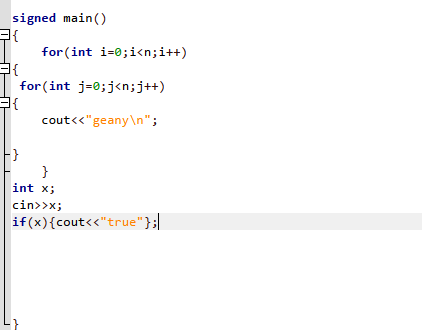
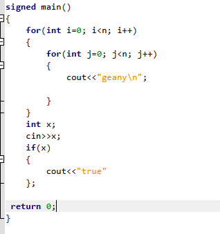

# Geany C++ Formatter

A simple walkthrough to set up a **C++ formatter** for the Geany editor using [Artistic Style (AStyle)](https://astyle.sourceforge.net/).

---

<table>
  <tr>
    <td align="center"><strong>Before Formatting</strong></td>
    <td align="center"><strong>After Formatting</strong></td>
  </tr>
  <tr>
    <td></td>
    <td></td>
  </tr>
</table>

---

## Step 1: Install Artistic Style

- Download and install Artistic Style from the official site:  
  https://astyle.sourceforge.net/

- Extract the downloaded archive and locate the `astyle.exe` file inside the folder.

- Copy the **full path** to `astyle.exe`.  
  make sure  astyle.exe included at the end of the path
---
## Step 2: Configure Geany

1. Open Geany.

2. Go to:  
 `Edit` → `Format` → `Send Selection To...` → `Set Custom Command`

4. Click **Add** and enter the following command (replace `path` with your actual path):   
path --style=allman --indent=spaces=4

---
## Step 3: Using the Formatter

- Before formatting, **select the entire file** with `Ctrl + A`.

- Use the custom formatter command from the `Send Selection To` menu.

- You can assign a shortcut to your formatter command:  
For example, if the formatter is the first custom command, press `Ctrl + 1` to run it quickly.
